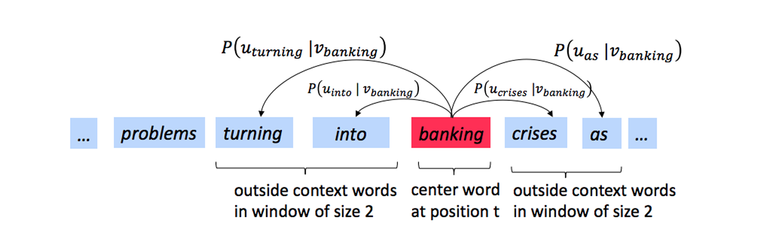

# 书面题：理解 word2vec（31 分）

`word2vec` 的核心思想是：“一个词的含义由它周围的词决定。”

具体来说，我们考虑一个中心词 $ c $，其前后一定长度范围内的上下文词称为“外部词”($ O $)。



例如，在图 1 中，上下文窗口长度为 2，中心词 $ c $ 是 "banking"，外部词是 "turning"、"into"、"crises" 和 "as"。

## Skip-gram 模型

Skip-gram 版本的 `word2vec` 目标是学习条件概率分布 $ P(O|C) $。对于给定的两个词 $ o $ 和 $ c $，我们希望预测：

$$
P(O = o \mid C = c)
$$

即在中心词 $ c $ 出现的情况下，词 $ o $ 是其上下文词的概率。

我们通过向量点积并使用 softmax 函数来建模这个概率：

$$
P(O = o \mid C = c) = \frac{\exp(\mathbf{u}_o^\top \mathbf{v}_c)}{\sum_{w \in \text{Vocab}} \exp(\mathbf{u}_w^\top \mathbf{v}_c)}
$$

每个词都有两个向量表示：

- $ \mathbf{u}_o $：外部词 $ o $ 的向量
- $ \mathbf{v}_c $：中心词 $ c $ 的向量

这些参数存储在两个矩阵中：

- 矩阵 $ U $：列是所有外部词向量 $ \mathbf{u}_w $
- 矩阵 $ V $：列是所有中心词向量 $ \mathbf{v}_w $

两个矩阵都包含词汇表中每个词的向量。

根据课堂所学，对于一对词 $ c $ 和 $ o $，损失函数定义如下：

$$
J_{\text{naive-softmax}}(\mathbf{v}_c, o, U) = -\log P(O = o \mid C = c)
\tag{2}
$$

我们可以将此损失看作是真实分布 $ y $ 和模型预测分布 $ \hat{y} $ 之间的**交叉熵**。

其中，$ y $ 和 $ \hat{y} $ 都是长度等于词汇表大小的向量，第 $ k $ 个元素代表该词作为当前中心词上下文词的条件概率。

真实分布 $ y $ 是一个 one-hot 向量，在对应真实外部词的位置为 1，其余为 0。

预测分布 $ \hat{y} $ 就是我们模型在公式 (1) 中计算出的概率分布。

> 注意：在整个作业中进行求导时，请使用课堂上讲解的方法（不要使用泰勒展开近似）。


## (a)（2 分）

证明 naive-softmax 损失（公式 2）与真实分布 $ y $ 和预测分布 $ \hat{y} $ 之间的交叉熵损失相同，即：

$$
-\sum_{w \in \text{Vocab}} y_w \log(\hat{y}_w) = -\log(\hat{y}_o)
$$

其中 $ y, \hat{y} $ 是向量，$ \hat{y}_o $ 是标量。

你的答案应只用一行。你可以用文字描述你的答案。

---

## (b)（7 分）

### (i) 计算 $ J_{\text{naive-softmax}}(\mathbf{v}_c, o, U) $ 关于 $ \mathbf{v}_c $ 的偏导数

请用 $ y $、$ \hat{y} $ 和 $ U $ 表示你的答案，并展示推导过程以获得满分。

- 注意：你最终的答案应遵循形状约定：
  - 任意函数 $ f(x) $ 对 $ x $ 的偏导数应与 $ x $ 具有相同的形状。
- 请以向量化形式给出答案。例如，当要求你使用 $ y $、$ \hat{y} $ 和 $ U $ 表达时，最终答案中不应出现这些项的具体元素（如 $ y_1, y_2, \dots $）。

### (ii) 什么情况下你计算出的梯度为零？

提示：你可以回顾并使用一些基础线性代数概念。

### (iii) 你求得的梯度是两个项的差值。请解释这两个项在将该梯度从词向量 $ \mathbf{v}_c $ 中减去时是如何改善词向量的。

### (iv) 在许多下游任务中，使用的是 L2 归一化的词向量（例如 $ \mathbf{u}/\|\mathbf{u}\|_2 $，其中 $ \|\mathbf{u}\|_2 = \sqrt{\sum_i u_i^2} $），而不是原始形式的向量（如 $ \mathbf{u} $）。

现在假设你想对短语进行分类，判断其是积极还是消极情感。  
在什么情况下 L2 归一化会丢失对下游任务有用的信息？在什么情况下不会？

> 提示：考虑 $ \mathbf{u}_x = \alpha \mathbf{u}_y $ 的情况，其中 $ x \neq y $，且 $ \alpha $ 是某个标量。

---

## (c)（5 分）

计算 $ J_{\text{naive-softmax}}(\mathbf{v}_c, o, U) $ 关于每个“外部”词向量 $ \mathbf{u}_w $ 的偏导数。

分为两种情况：
- 当 $ w = o $ 时，表示真实的“外部”词向量；
- 当 $ w \neq o $ 时，表示其他所有词。

请用 $ y $、$ \hat{y} $ 和 $ \mathbf{v}_c $ 表示你的答案。在此小题中，你可以使用这些变量中的具体元素（如 $ y_1, y_2, \dots $）。

注意：$ \mathbf{u}_w $ 是一个向量，而 $ y_1, y_2, \dots $ 是标量。请展示推导过程以获得满分。

---

## (d)（1 分）

写出 $ J_{\text{naive-softmax}}(\mathbf{v}_c, o, U) $ 关于矩阵 $ U $ 的偏导数。

请将其表示为列向量的形式：  
$$
\frac{\partial J}{\partial \mathbf{u}_1}, \frac{\partial J}{\partial \mathbf{u}_2}, \cdots, \frac{\partial J}{\partial \mathbf{u}_{|\text{Vocab}|}}
$$
不需要推导过程，只需以矩阵形式给出答案。

---

## (e)（2 分）

Leaky ReLU（带泄露的整流线性单元）激活函数由以下公式定义：

$$
f(x) = \max(\alpha x, x)
$$

其中 $ x $ 是标量，且 $ 0 < \alpha < 1 $。请计算 $ f(x) $ 对 $ x $ 的导数。  
你可以忽略在 $ x = 0 $ 处导数未定义的情况。

---

## (f)（3 分）

Sigmoid 函数由以下公式定义：

$$
\sigma(x) = \frac{1}{1 + e^{-x}} = \frac{e^x}{e^x + 1}
$$

请计算 $ \sigma(x) $ 对 $ x $ 的导数，其中 $ x $ 是标量。  
请用 $ \sigma(x) $ 表示你的答案，并展示推导过程以获得满分。

---

## (g)（6 分）

我们现在考虑负采样损失（Negative Sampling Loss），它是 Naive Softmax 损失的一种替代方案。  
假设从词汇表中抽取了 $ K $ 个负样本（词），分别记作 $ w_1, w_2, \dots, w_K $，它们的“外部”词向量分别为 $ \mathbf{u}_{w_1}, \mathbf{u}_{w_2}, \dots, \mathbf{u}_{w_K} $。

对于本题，假设这 $ K $ 个负样本互不相同（即 $ i \neq j \Rightarrow w_i \neq w_j $）。注意 $ o \notin \{w_1, \dots, w_K\} $。  
给定中心词 $ c $ 和外部词 $ o $，负采样损失函数如下：

$$
J_{\text{neg-sample}}(\mathbf{v}_c, o, U) = -\log(\sigma(\mathbf{u}_o^\top \mathbf{v}_c)) - \sum_{s=1}^{K} \log(\sigma(-\mathbf{u}_{w_s}^\top \mathbf{v}_c))
$$

其中 $ \sigma(\cdot) $ 是 Sigmoid 函数。

### (i)

请重复第 (b) 和 (c) 部分的内容，计算 $ J_{\text{neg-sample}} $ 关于 $ \mathbf{v}_c $、关于 $ \mathbf{u}_o $ 以及关于第 $ s $ 个负样本 $ \mathbf{u}_{w_s} $ 的偏导数。

请用 $ \mathbf{v}_c $、$ \mathbf{u}_o $ 和 $ \mathbf{u}_{w_s} $（其中 $ s \in [1, K] $）表示你的答案。  
展示推导过程以获得满分。

> 提示：你可以利用第 (f) 小题的结果来帮助计算所需的梯度。

### (ii)

在课堂上我们了解到，高效的反向传播实现依赖于已计算偏导数的复用。  
在上述三个偏导数中，哪一个数量可以被复用以减少重复计算？

请用以下方式表达你的答案：

- $ U_{o,\{w_1,\dots,w_K\}} = [\mathbf{u}_o, -\mathbf{u}_{w_1}, \dots, -\mathbf{u}_{w_K}] $，是一个将外部词向量按列堆叠的矩阵；
- $ \mathbf{1} $，是一个 $ (K+1)\times1 $ 的全 1 向量。

你可以使用除 $ U_{o,\{w_1,\dots,w_K\}} $ 和 $ \mathbf{1} $ 以外的额外项和函数。

### (iii)

请用一句话说明为什么这个损失函数比 naive-softmax 损失更高效。

> 注：到目前为止，我们讨论了如何复用计算结果，以及通过采样近似 softmax 来加速梯度下降。需要注意的是，在现代 GPU 上，某些优化可能不再必要，某种程度上只是开发这些算法时受限于当时的计算资源所留下的历史产物。

---

## (h)（2 分）

我们现在重复前一小题的练习，但不再假设抽取的 $ K $ 个词是互不相同的。  
假设从词汇表中抽取了 $ K $ 个负样本词，记作 $ w_1, w_2, \dots, w_K $，对应的外部词向量为 $ \mathbf{u}_{w_1}, \dots, \mathbf{u}_{w_K} $。  
在本题中，你不能假设这些词是不同的，也就是说，当 $ i \neq j $ 时，$ w_i = w_j $ 可能成立。注意 $ o \notin \{w_1, \dots, w_K\} $。

负采样损失函数仍为：

$$
J_{\text{neg-sample}}(\mathbf{v}_c, o, U) = -\log(\sigma(\mathbf{u}_o^\top \mathbf{v}_c)) - \sum_{s=1}^{K} \log(\sigma(-\mathbf{u}_{w_s}^\top \mathbf{v}_c))
$$

请计算 $ J_{\text{neg-sample}} $ 关于某个负样本 $ \mathbf{u}_{w_s} $ 的偏导数。

请用 $ \mathbf{v}_c $ 和 $ \mathbf{u}_{w_s} $（其中 $ s \in [1,K] $）表示你的答案。  
展示推导过程以获得满分。

> 提示：将损失函数中的求和拆分为两部分：一部分是对所有等于 $ w_s $ 的抽样词求和，另一部分是对所有不等于 $ w_s $ 的抽样词求和。在符号表示上，你可以在求和符号下方写入条件，例如如公式 (8) 所示。

---

## (i)（3 分）

假设中心词是 $ c = w_t $，上下文窗口是：

$$
[w_{t-m}, \dots, w_{t-1}, w_t, w_{t+1}, \dots, w_{t+m}]
$$

其中 $ m $ 是上下文窗口大小。

回忆一下，在 skip-gram 版本的 word2vec 中，整个上下文窗口的总损失为：

$$
J_{\text{skip-gram}}(\mathbf{v}_c, w_{t-m}, \dots, w_{t+m}, U) = \sum_{\substack{-m \leq j \leq m \\ j \neq 0}} J(\mathbf{v}_c, w_{t+j}, U)
$$

其中 $ J(\mathbf{v}_c, w_{t+j}, U) $ 表示中心词 $ c = w_t $ 与外部词 $ w_{t+j} $ 的任意损失项。  
它可以是 $ J_{\text{naive-softmax}} $ 或 $ J_{\text{neg-sample}} $，取决于你的实现。

请写出以下三个偏导数：

(i) $ \displaystyle \frac{\partial J_{\text{skip-gram}}}{\partial U} $

(ii) $ \displaystyle \frac{\partial J_{\text{skip-gram}}}{\partial \mathbf{v}_c} $

(iii) $ \displaystyle \frac{\partial J_{\text{skip-gram}}}{\partial \mathbf{v}_w} \quad \text{当 } w = c $

请用 $ \displaystyle \frac{\partial J(\mathbf{v}_c, w_{t+j}, U)}{\partial U} $ 和 $ \displaystyle \frac{\partial J(\mathbf{v}_c, w_{t+j}, U)}{\partial \mathbf{v}_c} $ 表示你的答案。每道题的答案只需一行即可。

完成后你会发现：既然你已经计算出了 $ J(\mathbf{v}_c, w_{t+j}, U) $ 关于模型参数 $ U $ 和 $ V $ 的偏导数，那么你就已经完成了完整损失函数 $ J_{\text{skip-gram}} $ 关于所有参数的导数计算。你现在可以实现 word2vec 了！


# 2 编程：实现 word2vec（18 分）

在本部分中，你将实现 word2vec 模型，并使用随机梯度下降（SGD）训练你自己的词向量。

在开始之前，请先运行以下命令以创建合适的 conda 虚拟环境：

```bash
conda env create -f env.yml
conda activate a2
```

完成作业后，可以通过以下命令退出该环境

```bash
conda deactivate
```

对于你需要实现的每一个方法，我们提供了参考代码行数（见注释），这些数字仅供你参考。你可以写更少或更多代码，只要功能正确即可。如果你的代码明显比我们的参考解长很多，说明你可以利用一些 NumPy 方法来简化并加速你的代码。Python 中的 `for` 循环在处理大型数组时效率很低，因此我们要求你使用 NumPy 方法。我们会检查你代码的执行效率。你可以在 Gradescope 提交后看到自动评分的结果，建议尽早且频繁提交。

> 注意：如果你在 Windows 上运行本部分中的 `.sh` 脚本遇到问题，可以尝试 Gow 工具，或者手动运行脚本中的命令。 

------

## (a)（12 分）

我们将从 `word2vec.py` 中的方法实现开始。你可以通过以下命令单独测试某个方法：

```bash
python word2vec.py <method_name>
```

例如，要测试 `sigmoid` 方法，可以运行：

```bash
python word2vec.py sigmoid
```

具体任务如下：

### (i) 实现 sigmoid 方法

该方法接收一个向量，并对其应用 sigmoid 函数。

### (ii) 实现 `naiveSoftmaxLossAndGradient` 方法中的 softmax 损失和梯度

### (iii) 实现 `negSamplingLossAndGradient` 方法中的负采样损失和梯度

### (iv) 实现 `skipgram` 方法中的 skip-gram 模型逻辑

完成后，通过运行以下命令测试整个实现：

```bash
python word2vec.py
```

------

## (b)（4 分）

请在 `sgd.py` 的 `sgd` 方法中完成 SGD 优化器的实现。
通过运行以下命令测试你的实现：

```bash
python sgd.py
```

------

## (c)（2 分）

现在我们来加载真实数据，并使用你刚刚实现的代码来训练词向量。我们将使用 Stanford Sentiment Treebank (SST) 数据集来训练词向量，并将其应用于一个简单的情感分析任务。

首先获取数据集，请运行：

```bash
sh get_datasets.sh
```

这部分不需要你编写额外代码，只需运行：

```bash
python run.py
```

注意：训练过程可能耗时较长，取决于你的实现效率和机器性能（高效实现大约需要一到两个小时），请合理安排时间！

经过大约 40,000 次迭代后，脚本会结束，并显示你训练出的词向量的可视化图。该图也会被保存为 `word_vectors.png` 文件。请将此图像包含在你的作业提交中，并用最多三句话简要解释你在图中观察到的内容。你可以包括但不限于对词向量聚类情况的描述，以及哪些词应该聚类但没有聚类的现象。

------

# 3 提交说明

你需要在 Gradescope 上进行两次提交：

- 一次提交给 “Assignment 2 [coding]”
- 另一次提交给 “Assignment 2 [written]”

具体步骤如下：

(a) 运行以下脚本来生成提交文件：

```bash
./collect_submission.sh
```

它将生成 `assignment2.zip` 压缩包。

(b) 将 `assignment2.zip` 提交至 Gradescope 的 “Assignment 2 [coding]”。

(c) 将你的书面解答提交至 Gradescope 的 “Assignment 2 [written]”。
