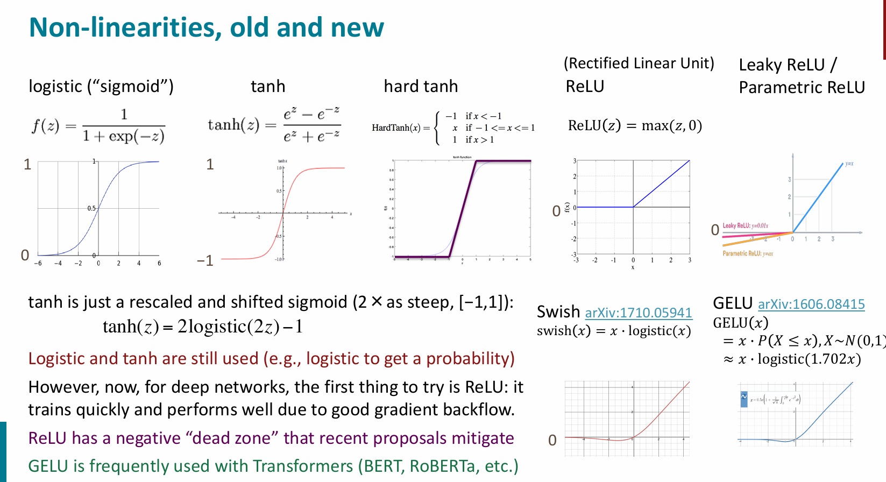

# lec3

### 参数更新公式

$$
\theta^{(t+1)} = \theta^{(t)} - \alpha \nabla_{\theta^{(t)}} J
$$

**说明**:  
在第 _t_+1 步更新参数时,我们沿损失函数 _J_ 的负梯度方向(下降最快方向)移动一小步(由学习率 _α_ 控制),逐步降低损失函数值.

---

### 简单神经网络前向传播

$$
\begin{align*}
\boldsymbol{x} &: \text{输入向量} \\
\boldsymbol{h} &= f(\boldsymbol{Wx + b}) \quad (\text{激活函数 } f) \\
s &= \boldsymbol{u}^T\boldsymbol{h} \quad (\text{输出得分}) \\
J_t(\theta) &= -\log\sigma(s) \quad (\text{交叉熵损失}) \\
\text{其中 } \sigma(s) &= \frac{1}{1+\exp(-s)} \in (0,1]
\end{align*}
$$

**注**:

- 最终输出通过 sigmoid 将得分映射为概率
- 损失函数应为负对数似然(修正原始公式)
- 完整训练需结合反向传播算法优化参数

## 🧠 常见 Non-linearities(激活函数)

| 名称                            | 公式                                                                                | 图像特点                   | 优点                          | 缺点                          |
| ------------------------------- | ----------------------------------------------------------------------------------- | -------------------------- | ----------------------------- | ----------------------------- |
| **Sigmoid**                     | $\sigma(x) = \dfrac{1}{1 + e^{-x}}$                                                 | S 型曲线,输出在 (0,1)      | 可解释为概率                  | 梯度消失、不以零为中心        |
| **Tanh**                        | $\tanh(x) = \dfrac{e^x - e^{-x}}{e^x + e^{-x}}$                                     | S 型曲线,输出在 (-1,1)     | 输出均值接近 0                | 仍有梯度消失问题              |
| **ReLU(Rectified Linear Unit)** | $\text{ReLU}(x) = \max(0, x)$                                                       | 左侧为 0,右侧为直线        | 计算高效,缓解梯度消失         | 负数部分无响应,神经元可能死亡 |
| **Leaky ReLU**                  | $\text{Leaky ReLU}(x) = \begin{cases} x & x > 0 \\ \alpha x & x \leq 0 \end{cases}$ | 类似 ReLU,但负值有小斜率   | 解决 ReLU 死区问题            | 参数 $\alpha$ 需要调参        |
| **ELU**                         | $\text{ELU}(x) = \begin{cases} x & x > 0 \\ \alpha(e^x - 1) & x \leq 0 \end{cases}$ | 左侧指数下降,右侧为直线    | 输出均值接近 0,收敛快         | 计算稍复杂                    |
| **Swish**                       | $\text{Swish}(x) = x \cdot \sigma(x)$                                               | 自门控结构,平滑连续        | 性能优于 ReLU                 | 计算成本高                    |
| **GELU**                        | $\text{GELU}(x) = x \cdot \Phi(x)$                                                  | 类似 Swish,基于正态分布    | 表现优秀,广泛用于 Transformer | 计算较复杂                    |
| **Softmax**                     | $\text{Softmax}(x_i) = \dfrac{e^{x_i}}{\sum_j e^{x_j}}$                             | 多分类输出归一化为概率分布 | 常用于最后一层                | 不适合作为隐藏层激活函数      |

## 中文翻译

**使用“交叉熵损失”进行训练 —— 你在 PyTorch 中经常用到它！**

- 到目前为止,我们的目标被表述为:**最大化正确类别 y 的概率**,  
  或者等价地,**最小化该类别的负对数概率**.
- 现在我们从信息论中的一个概念——**交叉熵(Cross Entropy)**的角度重新表述这个目标.
- 设真实概率分布为 _p_;模型输出的概率分布为 _q_.
- 交叉熵定义为:

$$
H(p, q) = -\sum_i p_i \log q_i
$$

- 假设真实标签(或称为目标、黄金标准)是一个 one-hot 分布,即在正确类别处为 1,其余为 0,  
  即 $ p = [0, ..., 0, 1, 0, ..., 0] $.
- 因为 _p_ 是 one-hot 向量,所以只剩下对应正确类别的那一项,即:  
  **负对数似然(Negative Log-Likelihood)**:  
  $ -\log p(y|x) $

## 2.计算

### 梯度与雅可比矩阵

对于标量函数 $ f(\boldsymbol{x}) = f(x_1, ..., x_n) $,其梯度为:

$$
f(\boldsymbol{x})= f(x_1,x_2,...,x_n)\\
\nabla_{\boldsymbol{x}} f = \frac{\partial f}{\partial \boldsymbol{x}} = \left[ \frac{\partial f}{\partial x_1},\, \dots,\, \frac{\partial f}{\partial x_n} \right]
$$

对于向量值函数 $ \boldsymbol{f}(\boldsymbol{x}) = [f_1(\boldsymbol{x}),\, \dots,\, f_m(\boldsymbol{x})]^T $,其雅可比矩阵为:

$$
\mathbf{J}_{\boldsymbol{f}} = \frac{\partial \boldsymbol{f}}{\partial \boldsymbol{x}} =
\begin{bmatrix}
\frac{\partial f_1}{\partial x_1} & \cdots & \frac{\partial f_1}{\partial x_n} \\
\vdots & \ddots & \vdots \\
\frac{\partial f_m}{\partial x_1} & \cdots & \frac{\partial f_m}{\partial x_n} \\
\end{bmatrix} \\
其中\left( \frac{\partial \boldsymbol{f}}{\partial \boldsymbol{x}} \right)_{ij} = \frac{\partial f_i}{\partial x_j}
$$

---

### 反向传播的链式法则示例

设 $ h = f(z) $,其中每个 $ h_i = f(z_i) $,则导数为:

$$
\frac{\partial h_i}{\partial z_j} =
\begin{cases}
f'(z_i) & \text{if } i = j \\
0       & \text{otherwise}
\end{cases}
$$

对于复合函数 $ \boldsymbol{h} = f(\boldsymbol{Wx + b}) $,链式法则展开为:

$$
\frac{\partial \boldsymbol{h}}{\partial \boldsymbol{x}}
= \underbrace{\frac{\partial \boldsymbol{h}}{\partial \boldsymbol{z}}}_{\text{对角矩阵}}
\cdot \underbrace{\frac{\partial \boldsymbol{z}}{\partial \boldsymbol{x}}}_{\text{权重矩阵} \boldsymbol{W}}
$$

其中:

- $ \boldsymbol{z} = \boldsymbol{Wx + b} $
- $ \frac{\partial \boldsymbol{h}}{\partial \boldsymbol{z}} $ 是对角矩阵,对角线元素为 $ f'(z_i) $
- $ \frac{\partial \boldsymbol{z}}{\partial \boldsymbol{x}} = \boldsymbol{W} $

反向传播的具体计算见 pdf 文件
